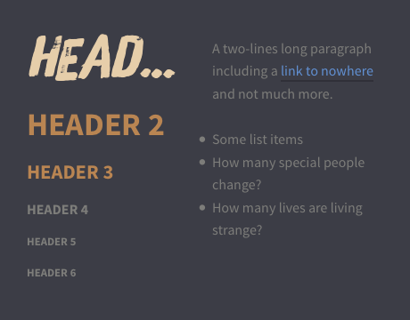
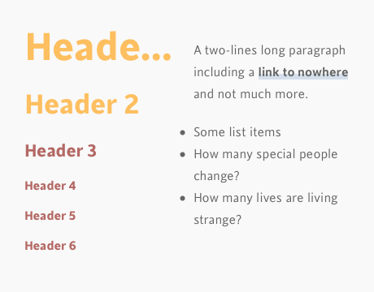

Markdown Utilities
==================

Markdown stylesheets and other minutiae.

Stylesheets
-----------

### Features

- High readability
- Fully responsive
- No dependencies and graceful font fallbacks for usage in sandboxed environments (e.g. iPhone/iPad)
- Decent print styles (browser support for printing is inconsistent but Chrome seems to deliver the best results).

### Styles

**Godspeed**

---

**New Modern**

---

**Torpedo**

---

**Vostok**

---

**Table of Figures** and **Table of Tables** respectively display only the images and tables of the loaded Markdown document. It can be handy to sift through those content types only in long documents.

### Installation

Depending on the editor used (e.g. [Marked](http://markedapp.com/), [MultiMarkdown Composer](http://multimarkdown.com/), [Mou](http://mouapp.com/) on the Mac, [Elements](http://www.secondgearsoftware.com/elements/) on iPhone/iPad), look for "Style", "Stylesheet", "Theme" or "CSS", usually in the Preferences. Proceed to import the `.css` files as offered.

Specimens
---------

`MultiMarkdown Specimen (short).md` provides a quick sample of the most common HTML tags. It's used to make the previews on this page.

`MultiMarkdown Specimen (long).md` includes most MultiMarkdown supported syntax, for development and testing.