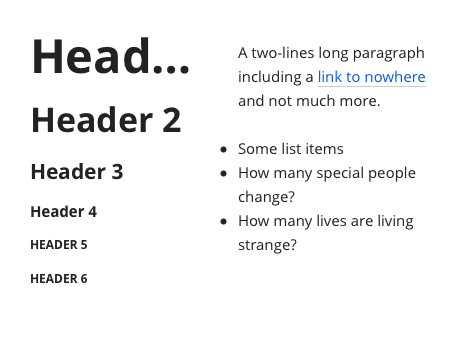
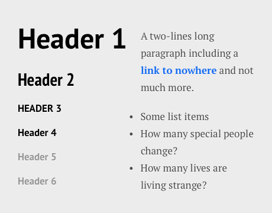

Markdown Utilities
==================

**Markdown stylesheets and other minutiae.**

Stylesheets
-----------

### Installation

It depends on the editor used (e.g. [Marked](http://markedapp.com/), [MultiMarkdown Composer](http://multimarkdown.com/), [Mou](http://mouapp.com/) on the Mac, [Elements](http://www.secondgearsoftware.com/elements/) on iPhone/iPad). Look for "Style", "Stylesheet", "Theme" or "CSS" in the Preferences, and import the `.css` files as usually offered.

They really are basic stylesheets that could be applied to any HTML. They differ in small ways, such as special rules for extra-niceties for Marked, no external dependencies to be as portable as possible, and so on.

### Features

- Fully responsive
- No dependencies and graceful font fallbacks for usage in sandboxed environments (e.g. iPhone/iPad)
- Decent print styles (browser support for printing is inconsistent but Chrome seems to deliver the best results).

### Styles

**Godspeed**

---

**New Modern**

---

**Torpedo**

---

**Vostok**

---

**Just Images** and **Just Tables** display respectively only images and only tables. It can be handy to sift through those content types only in long documents.

Specimens
---------

`MultiMarkdown Specimen (short).md` provides a quick sample of the most common HTML tags. It's used to make the previews on this page.

`MultiMarkdown Specimen (long).md` includes most MultiMarkdown supported syntax. It's intended for development and testing.